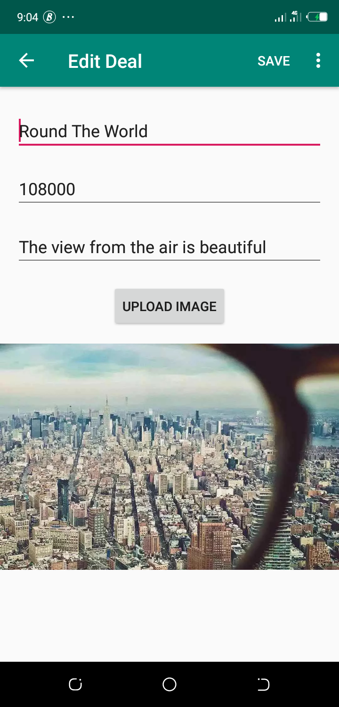
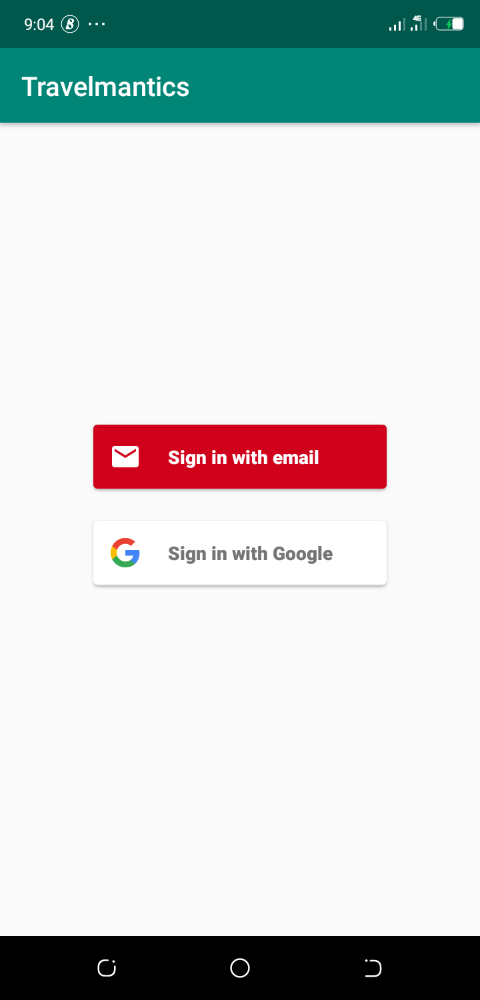

# Travelmantics
Travelmantics

 
  

**ALC 4 Android track chaalenge 2**

The following were used in the App:
<ul>
  <li><a href='https://firebase.google.com/docs/auth/android/firebaseui'>Firebase Authentication</a></li>
  <li><a href='https://firebase.google.com/docs/database/android/start'>Firebase Database</a></li>
  <li><a href='https://firebase.google.com/docs/storage/android/start'>Firebase Storage</a></li>
  <li><a href='https://github.com/bumptech/glide'>Glide </a></li>
  <li><a href='https://github.com/bumptech/glide'>Glide </a></li>
</ul>

